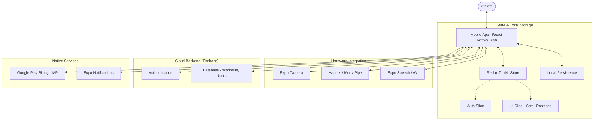

<div align="center">
  
  
  # 🏋️ FIZI - AI Fitness Trainer
  
  **The ultimate AI-driven personal trainer in your pocket.**
  
  
  
  
  
</div>

---

**FIZI** is a cutting-edge cross-platform mobile application that leverages device cameras to provide real-time exercise feedback, powered by Google's MediaPipe. It combines workout tracking, personalized diet planning, advanced gamification, and robust analytics to deliver a complete fitness ecosystem.

---

## ✨ Features

### 🦾 AI Vision Engine
- **Real-Time Pose Tracking**: Utilizes `@mediapipe/pose` to track body landmarks in real-time.
- **Intelligent Form Correction**: Analyzes movement patterns and provides actionable feedback on exercise form (e.g., squat depth, back straightness).
- **Automated Rep Counting**: Accurately counts repetitions when proper form criteria are met.
- **Voice Feedback**: Gives audible cues via `expo-speech` to guide the user without needing to look at the screen.

### 📊 Advanced Analytics & Tracking (Body Metrics)
- **Comprehensive Dashboard**: Beautiful charts powered by `react-native-chart-kit` visualizing workout volume, frequency, and adherence.
- **Daily Fuel**: A beautifully designed progress bar tracking daily caloric intake vs targets with BMR and TDEE reference points.
- **Workout History**: Detailed logs of past exercises, sets, reps, and performance metrics saved in Firebase Firestore.

### 🥗 Smart Nutrition 
- **Personalized Meal Plans**: Generates structured diet plans tailored to goals (Muscle Gain, Weight Loss, Maintenance) with Veg/Non-Veg preferences.
- **Macro Breakdowns**: Visualizes daily intake of Proteins, Carbs, and Fats.
- **Supplement Tracking**: Dedicated area for tracking daily supplements like Whey, Creatine, and Vitamins.

### 🎮 Gamification & Progression
- **RPG Elements**: Users level up from Beginner to Legend by earning XP through workouts.
- **Streaks & Achievements**: Tracks daily consecutive workouts to foster consistency with engaging UI notifications.

### 💎 Premium Experience Integration
- **In-App Purchases**: Seamless implementation using `react-native-iap` to unlock exclusive premium features, diet plans, and deep analytics.
- **Premium Gates**: Strategic paywalls protecting advanced insights while maintaining a core free tier.

---

## 🏗️ Technical Architecture



---

## 🛠️ Technology Stack & Dependencies

### Core Frameworks
- **React Native** (`0.76.x` via Expo SDK 52)
- **Expo** (`~52.0.28`) - Managed workflow with Custom Dev Clients
- **TypeScript** - Strict typing across the codebase

### State Management & Navigation
- **Redux Toolkit** (`@reduxjs/toolkit`) & `react-redux`
- **React Navigation** (`v7`) - Stack and Bottom Tabs integration

### Key Integrations
- **AI/Vision**: `@mediapipe/pose`, `expo-camera`
- **Backend**: `firebase` (Auth, Firestore)
- **Monetization**: `react-native-iap`
- **Sensors/Feedback**: `expo-speech`, `expo-haptics`, `expo-av`
- **UI/Visuals**: `expo-linear-gradient`, `expo-blur`, `react-native-svg`, `react-native-chart-kit`
- **Storage**: `@react-native-async-storage/async-storage`

---

## 📂 Project Structure

```
FIZI/
├── src/
│   ├── components/       # Reusable UI components (Buttons, Cards, Modals)
│   ├── config/           # Firebase & App configurations
│   ├── context/          # React Context providers (if any)
│   ├── hooks/            # Custom React Hooks (`useTheme`, `useAuth`)
│   ├── models/           # Typescript interfaces and data models
│   ├── screens/          # Primary Navigation screens (Home, Profile, Work)
│   ├── services/         # API and third-party service wrappers (NutritionService, etc.)
│   ├── store/            # Redux setup, slices, and selectors
│   ├── theme/            # Theme definitions (Colors, Shadows, Layouts)
│   ├── types/            # Global type definitions
│   └── utils/            # Helper functions and constants
├── app.json              # Expo configuration file
├── package.json          # Project dependencies
└── tsconfig.json         # TypeScript compiler options
```

---

## 👨‍💻 Developer
**Mahesh Challa**  
GitHub: [@MaheshChalla2701](https://github.com/MaheshChalla2701)  
Email: maheshchalla2701@gmail.com

---
<div align="center">
**Built for the future of decentralized fitness.**
</div>
