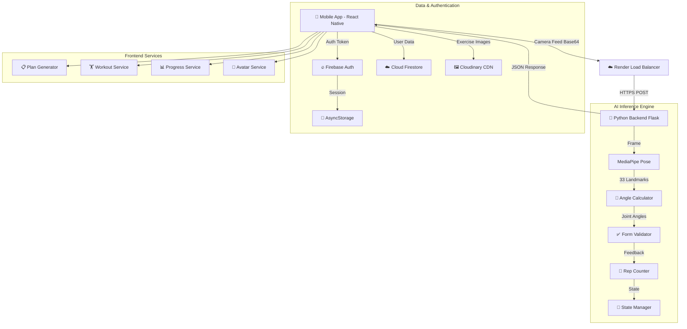

# 🏋️ FIZI - AI-Powered Fitness Trainer

> **Your Personal AI-Powered Gym Companion**  
> *Real-time form correction, intelligent rep counting, personalized workout plans, and comprehensive progress tracking.*


[](https://reactnative.dev/)
[](https://expo.dev/)
[](https://www.typescriptlang.org/)
[](https://www.python.org/)
[](https://firebase.google.com/)

## 🚀 Overview

FIZI is a cutting-edge mobile fitness application that combines **AI-powered computer vision** with **personalized workout planning** to deliver a comprehensive fitness experience. Built with React Native (Expo) and powered by a Python Flask backend using MediaPipe, FIZI analyzes your exercise form in real-time, counts repetitions accurately, and provides instant audio/haptic feedback—just like having a personal trainer in your pocket.

### 🎯 Core Value Proposition

- **AI Form Analysis**: Real-time pose detection and form validation using Google MediaPipe
- **Smart Rep Counting**: Accurate repetition counting with state management to prevent false positives
- **Personalized Plans**: Dynamic workout plan generation based on fitness level, goals, and available equipment
- **Progress Tracking**: Comprehensive analytics with visual history and level progression system
- **Full Exercise Library**: 100+ exercises across bodyweight, equipment, cardio, flexibility, and recovery categories

---

## ✨ Key Features

### 🎥 Real-Time AI Form Analysis
- **MediaPipe Pose Detection**: Detects 33 body keypoints with high accuracy
- **Live Form Validation**: Real-time feedback on exercise form and posture
- **Multi-Exercise Support**: Validates form for 53+ different exercises
- **Audio Feedback**: Dynamic voice commands like "Lower your hips!", "Keep your back straight!"
- **Haptic Feedback**: Tactile alerts for form corrections and milestone achievements

### 📊 Workout Planning & Tracking
- **Intelligent Plan Generation**: Personalized workout plans based on:
  - Fitness level (Beginner, Intermediate, Advanced)
  - Primary goals (Strength, Hypertrophy, Endurance, Weight Loss)
  - Available equipment (None, Basic, Full Gym)
  - Weekly workout frequency (3-6 days)
- **Progressive Overload**: Automatic progression with increasing intensity
- **Split Options**: PPL (Push-Pull-Legs), Upper/Lower, Full Body, Bro Split
- **Recovery Management**: Built-in rest day recommendations and recovery tracking

### 📈 Progress & Analytics
- **Workout History**: Complete log of all workouts with detailed metrics
- **Visual Progress**: Charts and graphs showing strength gains and consistency
- **Level System**: Gamified progression system with XP and levels
- **Body Composition Tracking**: Monitor weight, body fat %, muscle mass changes
- **Performance Analytics**: Track volume, intensity, and workout duration trends

### 🎨 User Experience
- **Custom Glassmorphism UI**: Modern, premium interface design
- **Dark Mode Support**: Optimized for low-light gym environments
- **Persistent Authentication**: Stay signed in securely with Firebase Auth + AsyncStorage
- **Offline Capability**: Local workout data caching for gym connectivity issues
- **Screen Wake Lock**: Keeps screen awake during active workouts

### 🔐 Security & Privacy
- **Firebase Authentication**: Secure user authentication with email/password
- **Cloud Firestore**: Encrypted cloud data storage
- **Privacy-First**: No personal data shared with third parties
- **Clear Permissions**: Transparent camera and storage access policies

---

## 🏗️ System Architecture



### Architecture Highlights

- **Microservices Design**: Backend AI engine separated from frontend for scalability
- **Cloud-Native**: Backend deployed on Render with auto-scaling
- **CDN Integration**: Exercise images served via Cloudinary for fast loading
- **State Management**: Redux Toolkit for predictable state updates
- **Type Safety**: Full TypeScript implementation across frontend

---

## 🛠️ Tech Stack

### **Frontend (Mobile App)**
| Technology | Purpose |
|------------|---------|
| **React Native (Expo SDK 50)** | Cross-platform mobile framework |
| **TypeScript** | Type-safe development |
| **Redux Toolkit** | Global state management |
| **React Navigation v6** | Screen navigation (Stack + Bottom Tabs) |
| **Expo Camera** | Real-time video capture for pose detection |
| **Expo AV** | Audio feedback playback |
| **Expo Linear Gradient** | Premium UI gradients |
| **AsyncStorage** | Local data persistence |
| **Firebase SDK** | Authentication & Cloud Firestore |

### **Backend (AI Server)**
| Technology | Purpose |
|------------|---------|
| **Python Flask** | RESTful API framework |
| **Google MediaPipe Pose** | BlazePose model for pose detection |
| **OpenCV (Headless)** | Image processing without GUI |
| **Gunicorn** | Production WSGI server |
| **Docker** | Containerized deployment |
| **Render.com** | Cloud hosting platform |

### **Development Tools**
| Tool | Purpose |
|------|---------|
| **Jest** | Unit testing framework |
| **TypeScript ESLint** | Code quality & linting |
| **Expo EAS** | Build and deployment pipeline |
| **Git** | Version control |

---

## 📱 App Screens

### Authentication Flow
- **LoginScreen**: Email/password authentication with Firebase
- **SignupScreen**: New user registration with validation
- **OnboardingScreen**: First-time user introduction to app features

### Main Navigation (Bottom Tabs)
- **HomeScreen**: Daily workout overview, quick start, and stats dashboard
- **CameraScreen**: Real-time AI form analysis with live pose detection
- **HistoryScreen**: Complete workout history with detailed logs
- **AvatarScreen**: User profile with body composition and progress metrics

### Feature Screens
- **ProfileSetupScreen**: Comprehensive onboarding questionnaire
  - Personal info (name, age, gender)
  - Body metrics (height, weight, body fat %)
  - Fitness level assessment
  - Goal selection
  - Equipment availability
  - Weekly schedule preferences
- **ExerciseLibraryScreen**: Browse 100+ exercises by category
- **ExerciseInstructionsScreen**: Detailed exercise guides with images and watermarked branding
- **LevelProgressScreen**: Gamified XP system with level visualization
- **AboutUsScreen**: App information and developer details
- **PrivacyPolicyScreen**: In-app privacy policy display
- **TermsOfServiceScreen**: In-app terms and conditions
- **DataUsageScreen**: Transparency about data collection and usage

---

## 🏋️ Exercise Library

### Total Exercises: 100+

#### Bodyweight Exercises (30+)
- **Upper Body**: Push-ups (Standard, Wide, Diamond, Decline), Dips, Pull-ups, Chin-ups, Pike Push-ups
- **Lower Body**: Squats, Lunges (Forward, Reverse, Walking), Glute Bridges, Bulgarian Split Squats, Calf Raises
- **Core**: Planks (Front, Side), Crunches, Bicycle Crunches, Leg Raises, Mountain Climbers, Russian Twists

#### Equipment-Based Exercises (40+)
- **Chest**: Bench Press (Flat, Incline, Decline), Dumbbell Press, Chest Flyes, Cable Crossovers
- **Back**: Deadlifts, Rows (Barbell, Dumbbell, Cable), Lat Pulldowns, Pull-ups, T-Bar Rows
- **Shoulders**: Overhead Press, Lateral Raises, Front Raises, Rear Delt Flyes, Arnold Press
- **Arms**: Bicep Curls (Barbell, Dumbbell, Cable), Tricep Extensions, Hammer Curls, Skull Crushers
- **Legs**: Squats (Barbell, Goblet), Leg Press, Leg Curls, Leg Extensions, Romanian Deadlifts

#### Cardio & Conditioning (15+)
- **High Intensity**: Burpees, Jumping Jacks, High Knees, Jump Rope, Box Jumps
- **Steady State**: Running, Cycling, Rowing, Stair Climbing

#### Flexibility & Mobility (10+)
- **Yoga Poses**: Downward Dog, Cobra Pose, Child's Pose, Cat-Cow, Warrior Poses
- **Stretches**: Hamstring Stretch, Hip Flexor Stretch, Shoulder Stretch, Quad Stretch

#### Recovery & Active Rest (8+)
- **Low Impact**: Walking, Light Cycling, Swimming, Foam Rolling
- **Mobility Work**: Dynamic Stretching, Joint Rotations

---

## 🧠 AI Services & Logic

### PlanGeneratorService
**Purpose**: Generates personalized workout plans based on user profile

**Key Functions**:
- `generateWorkoutPlan(userProfile)`: Creates complete weekly workout schedule
- **Smart Exercise Selection**: Filters exercises by:
  - Available equipment
  - Fitness level difficulty rating
  - Primary vs accessory movements
  - Muscle group targeting
- **Progressive Overload Logic**: Automatically adjusts sets, reps, and weight
- **Split Patterns**:
  - PPL (Push-Pull-Legs) - 6 days
  - Upper/Lower - 4-5 days
  - Full Body - 3 days
  - Bro Split - 5-6 days

### WorkoutService
**Purpose**: Manages workout sessions and progress logging

**Key Functions**:
- `startWorkout(plan)`: Initializes workout session
- `completeSet(exerciseId, reps, weight)`: Logs individual set data
- `endWorkout()`: Saves workout to Firestore with analytics
- **Auto-Sync**: Real-time cloud synchronization
- **Offline Support**: Local caching when network unavailable

### PoseDetectionService
**Purpose**: Interfaces with Python backend for AI form analysis

**Key Functions**:
- `analyzeFrame(base64Image, exerciseType)`: Sends frame to backend
- **Response Handling**: Processes pose landmarks, form feedback, rep counts
- **Error Recovery**: Graceful fallback if backend unavailable
- **Rate Limiting**: Prevents API overload during continuous streaming

### ProgressionService
**Purpose**: Manages level system and XP calculation

**Key Functions**:
- `calculateXP(workout)`: Awards XP based on workout completion
- `checkLevelUp(currentXP)`: Determines level progression
- **Milestones**: Unlocks achievements and badges

### AvatarService
**Purpose**: Manages user profile and body composition

**Key Functions**:
- `updateBodyComposition(metrics)`: Tracks physical changes
- `calculateBMI()`: Body Mass Index calculation
- `estimateBodyFat()`: Body fat percentage estimation
- **Progress Photos**: Before/after comparison support

---

## 🐍 Python Backend Details

### Core Modules

#### `main.py` - Flask API Server
- **Endpoints**:
  - `POST /analyze_pose`: Accepts base64 image + exercise type, returns pose analysis
  - `GET /health`: Health check endpoint
- **CORS Enabled**: Allows cross-origin requests from mobile app
- **Stateful Session Management**: Tracks rep counts per user session

#### `angle_calculator.py`
- **3D Angle Calculation**: Computes joint angles from MediaPipe landmarks
- **Key Angles**:
  - Elbow (arm exercises)
  - Knee (leg exercises)
  - Hip (squats, deadlifts)
  - Shoulder (overhead movements)
  - Torso (plank, core work)

#### `form_validator.py`
- **Exercise-Specific Rules**: 53 different exercise validation profiles
- **Form Checks**:
  - Joint angle ranges (e.g., squat depth must be <100°)
  - Body alignment (e.g., back straightness)
  - Movement tempo
  - Safety violations
- **Feedback Generation**: Human-readable form correction messages

#### `rep_counter.py`
- **State Machine Logic**: Tracks exercise phases (up, down, transition)
- **False Positive Prevention**: Multi-frame confirmation before counting rep
- **Persistent State**: Stores rep counts in `reps_state.json` per session
- **Reset Logic**: Clears state when exercise type changes

#### `exercise_configs.py`
- **Configuration Database**: Defines validation rules for each exercise
- **Per-Exercise Settings**:
  - Required joint angles
  - Acceptable angle ranges
  - Movement detection thresholds
  - Form feedback templates

### Deployment Configuration

#### `Dockerfile`
```dockerfile
FROM python:3.9-slim
# Headless OpenCV for reduced container size
RUN apt-get update && apt-get install -y libgl1-mesa-glx libglib2.0-0
COPY requirements.txt .
RUN pip install --no-cache-dir -r requirements.txt
COPY . /app
WORKDIR /app
CMD ["gunicorn", "--bind", "0.0.0.0:5000", "main:app"]
```

#### `render.yaml`
- **Auto-Deploy**: Triggers rebuild on git push to main
- **Environment**: Python 3.9
- **Build Command**: `pip install -r requirements.txt`
- **Start Command**: `gunicorn main:app`
- **Health Check**: `/health` endpoint monitoring

#### Production URL
🔗 **https://fizi-backend.onrender.com**

---

## 🚀 Getting Started

### Prerequisites
- **Node.js**: v18+ recommended
- **npm** or **yarn**: Latest version
- **Expo CLI**: Installed globally (`npm install -g expo-cli`)
- **Mobile Device**: Android or iOS with Expo Go app
- **Firebase Account**: For authentication setup

### 1. Clone the Repository
```bash
git clone https://github.com/MaheshChalla2701/FIZI.git
cd FIZI
```

### 2. Install Dependencies
```bash
npm install
```

### 3. Firebase Setup
Create a `.env` file in the root directory with your Firebase credentials:
```env
FIREBASE_API_KEY=your_api_key
FIREBASE_AUTH_DOMAIN=your_auth_domain
FIREBASE_PROJECT_ID=your_project_id
FIREBASE_STORAGE_BUCKET=your_storage_bucket
FIREBASE_MESSAGING_SENDER_ID=your_sender_id
FIREBASE_APP_ID=your_app_id
```

See [FIREBASE_SETUP.md](./FIREBASE_SETUP.md) for detailed instructions.

### 4. Run the App
```bash
npm start
# or
npx expo start --go
```

Scan the QR code with:
- **Android**: Expo Go app
- **iOS**: Camera app (opens Expo Go)

### 5. Run Tests
```bash
npm test
```

---

## 📦 Building for Production

### Android (Google Play Store)

#### Build AAB
```bash
# Install EAS CLI
npm install -g eas-cli

# Configure EAS
eas build:configure

# Build production AAB
eas build --platform android --profile production
```

#### Download AAB
1. Build completes on Expo servers
2. Download `.aab` file from Expo dashboard
3. Upload to Google Play Console

### iOS (App Store)

```bash
eas build --platform ios --profile production
```

See [DEPLOYMENT_GUIDE.md](./DEPLOYMENT_GUIDE.md) for complete deployment instructions.

---

## 🧪 Testing

### Unit Tests (Jest)
```bash
npm test
```

**Test Coverage**:
- `PlanGeneratorService.test.ts`: Workout plan generation logic
- Component tests: Critical UI components
- Service tests: API integrations

### Manual Testing Checklist
- [ ] Login/Signup flow
- [ ] Profile setup completion
- [ ] Workout plan generation
- [ ] Camera screen pose detection
- [ ] Rep counting accuracy
- [ ] Workout completion and saving
- [ ] History screen data display
- [ ] Level progression updates
- [ ] Offline mode functionality

---

## 📁 Project Structure

```
FIZI/
├── assets/                      # Images, icons, fonts
├── python_server/               # Backend AI server
│   ├── main.py                 # Flask API
│   ├── angle_calculator.py     # Joint angle math
│   ├── form_validator.py       # Exercise form rules
│   ├── rep_counter.py          # Rep counting logic
│   ├── exercise_configs.py     # Exercise definitions
│   ├── requirements.txt        # Python dependencies
│   └── Dockerfile              # Container config
├── src/
│   ├── components/             # Reusable UI components
│   │   ├── home/              # Home screen components
│   │   ├── ErrorBoundary.tsx  # Error handling
│   │   └── ...
│   ├── config/                 # App configuration
│   │   └── exercises/         # Exercise image mappings
│   ├── hooks/                  # Custom React hooks
│   ├── models/                 # Data models & types
│   │   ├── exercises.ts       # Exercise definitions
│   │   ├── cardio_exercises.ts
│   │   ├── flexibility_exercises.ts
│   │   └── ...
│   ├── screens/               # App screens
│   │   ├── LoginScreen.tsx
│   │   ├── HomeScreen.tsx
│   │   ├── CameraScreen.tsx
│   │   ├── AvatarScreen.tsx
│   │   └── ...
│   ├── services/              # Business logic
│   │   ├── authService.ts
│   │   ├── WorkoutService.ts
│   │   ├── PlanGeneratorService.ts
│   │   ├── PoseDetectionService.ts
│   │   └── ...
│   ├── store/                 # Redux state
│   │   ├── authSlice.ts
│   │   ├── userSlice.ts
│   │   └── workoutSlice.ts
│   ├── theme/                 # Design tokens
│   ├── types/                 # TypeScript types
│   └── utils/                 # Utility functions
├── App.tsx                    # Root component
├── app.json                   # Expo configuration
├── package.json               # Dependencies
├── tsconfig.json              # TypeScript config
├── jest.config.js             # Jest config
├── README.md                  # This file
├── DEPLOYMENT_GUIDE.md        # Deployment instructions
├── FIREBASE_SETUP.md          # Firebase setup guide
├── PRIVACY_POLICY.md          # Privacy policy
└── TERMS_OF_SERVICE.md        # Terms of service
```

---

## 🔐 Security & Privacy

### Data Collection
- **User Profile**: Name, age, gender, fitness metrics (encrypted in Firestore)
- **Workout Data**: Exercise logs, performance metrics (encrypted)
- **Authentication**: Email and hashed password (Firebase Auth)
- **Camera Access**: Used only during workout sessions, not recorded or stored

### Data Usage
- **No Third-Party Sharing**: Your data is never sold or shared
- **Cloud Storage**: All data encrypted at rest in Firebase
- **Secure Transit**: HTTPS for all API communications
- **Local Privacy**: Camera feed processed locally and via secure backend, never stored

See [PRIVACY_POLICY.md](./PRIVACY_POLICY.md) for full details.

---

## 🤝 Contributing

Contributions are welcome! Here's how you can help:

### Development Workflow
1. **Fork the Project**
2. **Create your Feature Branch**
   ```bash
   git checkout -b feature/AmazingFeature
   ```
3. **Commit your Changes**
   ```bash
   git commit -m 'Add some AmazingFeature'
   ```
4. **Push to the Branch**
   ```bash
   git push origin feature/AmazingFeature
   ```
5. **Open a Pull Request**

### Code Standards
- **TypeScript**: Use strict typing, no `any` types
- **ESLint**: Follow provided ESLint configuration
- **Testing**: Add tests for new features
- **Documentation**: Update README for significant changes

---

## 🐛 Known Issues & Future Enhancements

### Current Limitations
- **Backend Latency**: ~200-500ms response time on free tier (upgradable)
- **Exercise Coverage**: 53 validated exercises (expanding to 100+)
- **iOS Testing**: Limited real-device testing on iOS

### Roadmap
- [ ] Social features (friend challenges, leaderboards)
- [ ] Nutrition tracking integration
- [ ] Apple Watch / Wear OS support
- [ ] Video recording with pose overlay
- [ ] Custom workout plan creation
- [ ] Multi-language support
- [ ] Advanced analytics dashboard

---

## 👨‍💻 Developer

**Mahesh Challa**
- GitHub: [@MaheshChalla2701](https://github.com/MaheshChalla2701)
- Email: maheshchalla2701@gmail.com

---

## 🙏 Acknowledgments

- **Google MediaPipe**: For the incredible pose detection model
- **Expo Team**: For the amazing developer experience
- **Firebase**: For robust authentication and database services
- **React Native Community**: For comprehensive libraries and support

---

## 📞 Support

For issues, questions, or feature requests:
1. **GitHub Issues**: [Create an issue](https://github.com/MaheshChalla2701/FIZI/issues)
2. **Email**: maheshchalla2701@gmail.com
3. **Documentation**: Check existing docs in this repository

---

<div align="center">

**Built with ❤️ and 🏋️ by Mahesh Challa**

⭐ **Star this repo if you find it helpful!** ⭐

</div>
