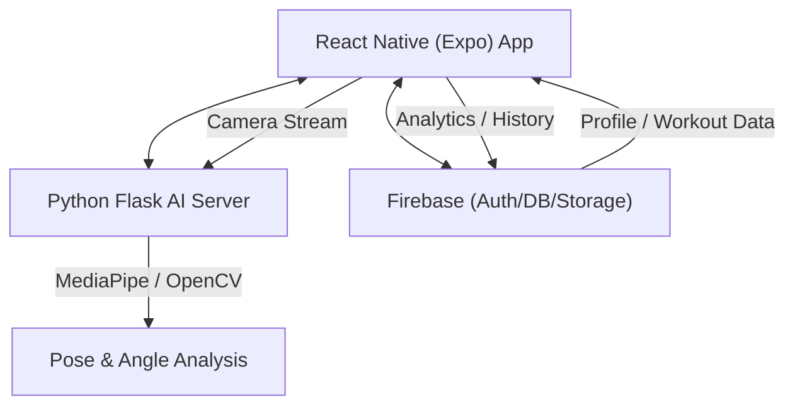

# FIZI (Fitness Genie)

[](https://expo.dev/)
[](https://reactnative.dev/)
[](https://www.python.org/)
[](https://flask.palletsprojects.com/)
[](https://firebase.google.com/)
[](https://mediapipe.dev/)

An advanced, AI-powered mobile fitness companion that uses real-time computer vision to analyze your workout form, count reps, and provide instant coaching. Featuring an evolving avatar system that transforms alongside your fitness journey.

---

## ✨ Core Features

### 📡 Real-Time AI Coaching
- **Precision Tracking**: Leverages a remote Python server powered by **MediaPipe** and **OpenCV** to track 33 body keypoints in real-time.
- **Dynamic Form Correction**: Receive instant visual and audio guidance if your form slips, ensuring you stay in the "Gold Standard" range.
- **Intelligent Rep Counting**: Automatically detects and counts reps for a wide variety of exercises (Push-ups, Squats, Bicep Curls, Lunges, and more).

### 📅 Intelligent Workout Scheduling
- **Personalized Plans**: Generates custom weekly schedules based on your **experience level**, **fitness goals**, and **available equipment**.
- **Adaptive Logic**: Filters exercises based on health constraints and muscle group priorities.

### 👤 Evolving Avatar & Gamification
- **Transformation Avatar**: Your digital self physically levels up and transforms as you complete workouts.
- **Achievement System**: Unlock medals and badges for consistency, form perfection, and personal bests.
- **Streak Tracking**: Maintain your momentum with daily streak visualizations.

### 📊 Professional Analytics
- **History Logs**: Detailed record of every rep, set, and session.
- **Form Scoring**: Average form quality metrics to help you identify areas for improvement.
- **Progress Metrics**: Track calories burned, total volume, and workout duration over time.

---

## 🏗️ System Architecture

FIZI uses a high-performance hybrid architecture to bridge mobile portability with server-side AI power:



---

## 🛠️ Tech Stack

- **Mobile Framework**: React Native with Expo (Managed Workflow)
- **Computer Vision**: 
  - **Server-Side**: Python Flask + MediaPipe + OpenCV (Advanced Vision)
  - **On-Device**: TensorFlow.js (MoveNet)
- **State Management**: Redux Toolkit
- **Backend-as-a-Service**: Firebase (Authentication, Firestore, Storage)
- **Real-Time Communication**: REST API for Vision Analysis
- **Navigation**: React Navigation (Bottom Tabs, Stack)

---

## 🚀 Getting Started

### 1. Project Prerequisites
- Node.js (v18+)
- Python (v3.9+)
- Expo Go App (for testing) or Android/iOS Emulator

### 2. Frontend Setup (Expo)
```bash
# Clone the repository
cd AI-TRAINER-main

# Install dependencies
npm install --legacy-peer-deps

# Create your .env file
# FIREBASE_API_KEY=...
```

### 3. AI Server Setup (Python)
The Python server handles the high-performance OpenCV/MediaPipe analysis.
```bash
# Navigate to server directory
cd python_server

# Install requirements
pip install flask flask-cors mediapipe opencv-python pillow numpy

# Start the server (Port 5002)
python main.py
```

### 4. Running the App
```bash
# Start Expo development server
npx expo start --lan
```
- Open **Expo Go** on your device.
- Scan the QR code.
- Ensure your phone and computer are on the **same Wi-Fi network**.

---

## 📈 Development Roadmap

### ✅ Completed Sprints
- [x] **Sprint 0: Infrastructure** - Setup Expo, Redux, and Firebase.
- [x] **Sprint 1: Authentication** - Google OAuth and Profile Setup.
- [x] **Sprint 2: Vision Bridge** - Integration with Python AI Server.
- [x] **Sprint 3: Analysis Engine** - Rep counting and form validation logic.
- [x] **Sprint 4: Smart Scheduler** - Dynamic plan generation based on user data.
- [x] **Sprint 5: Feedback System** - Audio instructions and haptic cues.
- [x] **Sprint 6: Avatar Evolution** - Gamified transformation system.
- [x] **Sprint 7: Data Analytics** - Comprehensive history and personal bests.

### ⏳ Current Focus
- [/] **Sprint 8: Optimization** - Refining pose detection latency and model precision.
- [ ] **Sprint 9: Deployment** - Native build generation and Store submission.

---

## 📂 Project Structure

```text
├── src/
│   ├── components/      # UI components (Overlays, Modals, Instructions)
│   ├── services/        # Business logic (PoseDetection, WorkoutAnalysis, Firebase)
│   ├── store/           # Redux logic (slices for Auth, Workout, Stats)
│   ├── screens/         # Main views (Home, Camera, Avatar, History, Onboarding)
│   ├── models/          # Exercise definitions and constants
│   └── hooks/           # Custom React hooks
├── python_server/       # Flask backend for AI processing
├── assets/              # Static assets and branding
└── App.tsx              # Application entry point & navigation
```

---
=======
# Summary 
Personalized Planning: It creates custom workout schedules based on your fitness goals, experience, and available equipment. 
Live AI Coaching: It uses your camera to "see" your body during workouts, provides real-time voice feedback to correct your form, and automatically counts your reps.
