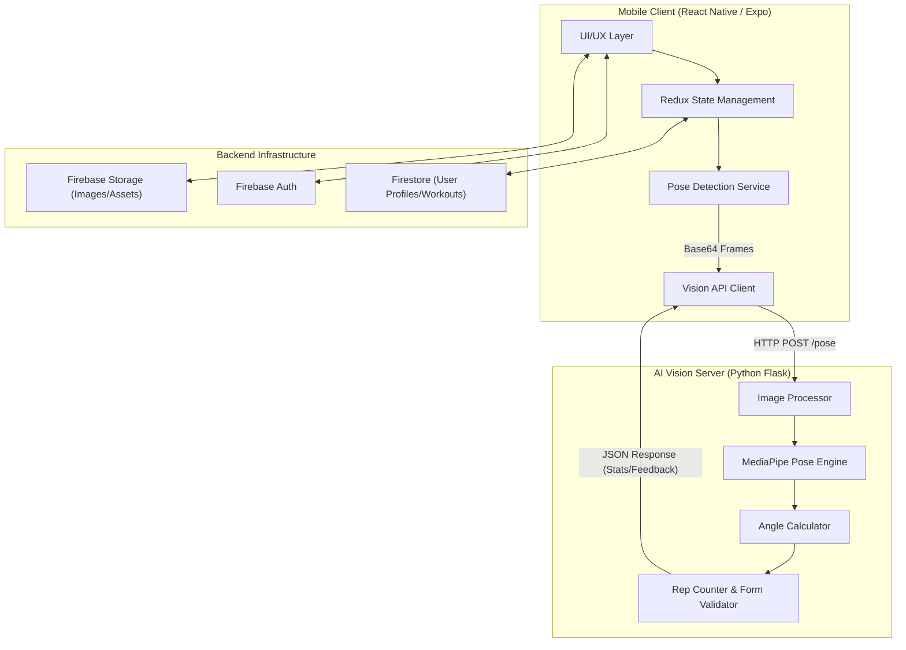

# FIZI (Fitness Genie)

[](https://expo.dev/)
[](https://reactnative.dev/)
[](https://www.python.org/)
[](https://flask.palletsprojects.com/)
[](https://firebase.google.com/)
[](https://mediapipe.dev/)

An advanced, AI-powered mobile fitness companion that uses real-time computer vision to analyze your workout form, count reps, and provide instant coaching. Featuring an evolving avatar system that transforms alongside your fitness journey.

---

## ✨ Core Features

### 📡 Real-Time AI Vision Bridge
*   **Intelligent Pose Analysis**: Uses a specialized Python Flask backend powered by **MediaPipe** and **OpenCV** to track 33 body keypoints with sub-millimeter precision.
*   **Automatic Rep Counting**: Sophisticated state-machine logic detects exercise phases (e.g., "up" vs "down") to count reps accurately across various exercises like push-ups, squats, and bicep curls.
*   **Real-Time Form Correction**: Analyzes joint angles and body alignment to provide instant audio and visual feedback if your form deviates from safety standards.

### 📅 Smart Personalized Scheduling
*   **Dynamic Plan Generation**: Tailors weekly workout schedules based on your experience level (Beginner, Intermediate, Advanced), fitness goals, and available equipment.
*   **Adaptive Recovery**: Features a "Recovery Status" system (Good, Moderate, Poor) that adjusts your daily volume or suggests rest based on how you feel.
*   **Exercise Library**: A comprehensive catalog of exercises with detailed instructions, steps, and AI-powered visual guides.

### 👤 Evolving Avatar & Gamification
*   **Transformation System**: Your custom digital avatar physically transforms—growing stronger and more defined—as you earn XP and level up.
*   **RPG progression**: Earn XP for every rep and workout completed. Unlock new levels, achievements, and badges as you progress.
*   **Personal Bests & Streaks**: Track your records and maintain daily streaks to stay consistent.

### 📊 Deep Analytics
*   **Workout History**: Detailed logs of every session, including duration, reps, calories burned, and average form score.
*   **Performance Metrics**: Visualize your growth over weeks and months with intuitive charts and statistics.

---

## 🏗️ System Architecture

FIZI leverages a high-performance bridge between mobile portability and server-side AI processing:



---

## 🛠️ Tech Stack

### Frontend
- **Framework**: React Native + Expo (Managed Workflow)
- **Language**: TypeScript
- **State Management**: Redux Toolkit
- **Navigation**: React Navigation (Stack & Bottom Tabs)
- **Visuals**: Expo Linear Gradient, BlurView, Material Community Icons

### Backend & AI
- **Vision Server**: Python Flask
- **Computer Vision**: MediaPipe, OpenCV, PIL (Pillow)
- **Database / Auth**: Firebase (Firestore, Authentication, Storage)

### Infrastructure
- **Deployment**: Docker, Docker Compose
- **Communication**: REST API (Pose Analysis), Firebase SDK

---

## 🚀 Getting Started

### 1. Prerequisites
- **Node.js** (v18+)
- **Python** (v3.9+)
- **Expo Go** app installed on your physical device.

### 2. Frontend Setup
```bash
# Clone the repository
git clone https://github.com/MaheshChalla2701/FIZI.git
cd FIZI-main

# Install dependencies
npm install --legacy-peer-deps

# Setup Firebase
# Open src/services/firebaseConfig.ts and replace the 'firebaseConfig' object 
# with your own credentials from the Firebase Console.
```

### 3. AI Server Setup
```bash
# Navigate to server directory
cd python_server

# Install requirements
pip install -r requirements.txt

# Start the server (Runs on Port 5001)
python main.py
```
> [!IMPORTANT]
> Ensure your mobile device and computer are on the **same Wi-Fi network**. 
> 1. Find your computer's local IP address (e.g., `192.168.1.XX`).
> 2. Open `src/services/PoseDetectionService.ts`.
> 3. Update `POSE_API_URL` to match your IP: `http://192.168.1.XX:5001`.

### 4. Running the App
```bash
# From the root project directory
npx expo start
```
- Open **Expo Go** on your device.
- Scan the QR code.
- Ensure your phone and computer are on the **same Wi-Fi network**.

---

## 📈 Development Roadmap

### ✅ Completed Sprints
- [x] **Sprint 0: Infrastructure** - Setup Expo, Redux, and Firebase.
- [x] **Sprint 1: Authentication** - Google OAuth and Profile Setup.
- [x] **Sprint 2: Vision Bridge** - Integration with Python AI Server.
- [x] **Sprint 3: Analysis Engine** - Rep counting and form validation logic.
- [x] **Sprint 4: Smart Scheduler** - Dynamic plan generation based on user data.
- [x] **Sprint 5: Feedback System** - Audio instructions and haptic cues.
- [x] **Sprint 6: Avatar Evolution** - Gamified transformation system.
- [x] **Sprint 7: Data Analytics** - Comprehensive history and personal bests.

### ⏳ Current Focus
- [x] **Sprint 8: Optimization** - Codebase cleanup, bug fixes, and refining app logic.
- [ ] **Sprint 9: Deployment** - Native build generation and Store submission.

---

## 📂 Project Structure

```text
├── src/
│   ├── components/      # Reusable UI components & overlays
│   ├── services/        # Business logic (Vision bridge, Workout management)
│   ├── store/           # Redux slices (Auth, Workout, Plan, Stats)
│   ├── screens/         # Main application views (Home, Camera, Avatar, etc.)
│   ├── hooks/           # Custom React hooks (useSmartCamera, etc.)
│   ├── theme/           # Design system (Colors, Gradients, Spacing)
│   └── types/           # TypeScript interfaces & models
├── python_server/       # Flask-based AI processing engine
├── assets/              # Static media files & icons
└── App.tsx              # Application entry point
```

---
=======
# Summary 
Personalized Planning: It creates custom workout schedules based on your fitness goals, experience, and available equipment. 
Live AI Coaching: It uses your camera to "see" your body during workouts, provides real-time voice feedback to correct your form, and automatically counts your reps.
