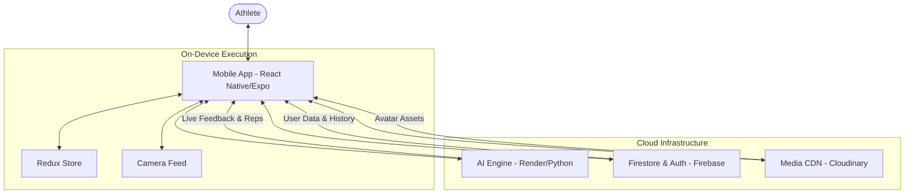

# 🏋️ FIZI - AI Fitness Trainer

**FIZI** is a cutting-edge, AI-powered mobile fitness companion designed to revolutionize your home workout experience. By combining real-time pose detection, personalized plan generation, and gamified progress tracking, FIZI brings a professional trainer's expertise directly to your smartphone.

---

## 🌟 Features

### 🤖 AI Real-Time Coaching
- **Pose Detection**: Analyzes your movements in real-time using your device's camera.
- **Form Feedback**: Provides instant corrective feedback to ensure safety and maximize efficiency.
- **Automatic Rep Counting**: High-precision counting for exercises like push-ups, squats, and jumping jacks without manual input.

### 📅 Hyper-Personalized Planning
- **Dynamic Plan Generation**: Tailors workout schedules based on your age, weight, height, fitness goals, and available equipment (Bodyweight/Home/Gym).
- **Adaptive Splits**: Automatically organizes your week into Upper Body, Lower Body, Full Body, and Recovery sessions.

### 🎮 Gamified Experience
- **Interactive Avatar**: Your digital self levels up as you complete workouts and earn XP.
- **Achievements & Streaks**: Earn badges for consistency, form perfection, and milestone rep counts.
- **Level Progression**: Unlock higher intensity workouts and advanced exercises as you grow stronger.

### 📊 Deep Analytics
- **Workout History**: Track every session with detailed stats on reps, duration, and calories burned.
- **Progress Visualization**: View your growth over weeks and months with intuitive charts.
- **Personal Bests**: Celebrate your highest rep counts and best form scores.

---

## 🛠️ How It Works

FIZI operates through a seamless interaction between a high-performance mobile frontend and a specialized AI backend.

- **Mobile App (React Native/Expo)**: The primary user interface where athletes manage their profile, view interactive plans, and track their daily progress.
- **AI Analysis (Python/MediaPipe)**: Real-time pose detection and workout analysis running on **Render**. It processes camera frames using **OpenCV** and **MediaPipe** to provide instant feedback.
- **Data Persistence (Firebase)**: Secure storage for user profiles, workout history, and real-time synchronization between devices.
- **Media Management (Cloudinary)**: High-speed delivery and storage for user avatars and body transformation photos.

---

## 🏗️ Architecture Diagram

---

## 👨‍💻 Developer & Support

**Mahesh Challa**  
GitHub: [@MaheshChalla2701](https://github.com/MaheshChalla2701) | Email: maheshchalla2701@gmail.com

---

**Built by Mahesh Challa**

