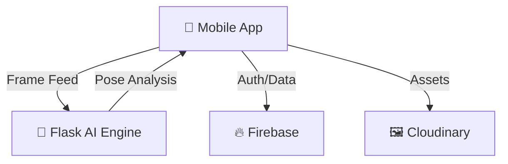

# 🏋️ FIZI-Fitness and Workouts

> **Your Personal AI-Powered Gym Companion**  
> *Real-time form correction, intelligent rep counting, and personalized workout plans.*


[](https://reactnative.dev/)
[](https://expo.dev/)
[](https://www.typescriptlang.org/)
[](https://www.python.org/)
[](https://firebase.google.com/)

## 🚀 Overview

FIZI is a mobile fitness application combining **AI computer vision** with **personalized planning**. Built with React Native (Expo) and a Python Flask backend (MediaPipe), it provides real-time form feedback and automated workout management.

### ✨ Key Features
- **AI Form Analysis**: Real-time pose detection and validation for 50+ exercises.
- **Smart Rep Counting**: Automated tracking with state management.
- **Personalized Plans**: Dynamic generation based on goals and equipment.
- **Progress Tracking**: Comprehensive analytics, XP level system, and body metrics.
- **Modern UI**: Premium glassmorphism design with dark mode support.

---

## 🏗️ System Architecture



---

## 🛠️ Tech Stack

| Frontend | Backend | Services |
|----------|---------|----------|
| React Native (Expo SDK 54) | Python Flask | Firebase (Auth/Store) |
| Redux Toolkit | MediaPipe Pose | Cloudinary (CDN) |
| TypeScript | OpenCV | Render (Hosting) |

---

## 🚀 Getting Started

### 1. Setup
```bash
git clone https://github.com/MaheshChalla2701/FIZI.git
cd FIZI
npm install
```

### 2. Environment Variables
Create a `.env` file with your **Firebase Credentials** (see [FIREBASE_SETUP.md](./FIREBASE_SETUP.md)).

### 3. Run
```bash
npm start # Scan QR code with Expo Go
```

---

## 📦 Building for Production

```bash
npm install -g eas-cli
eas build --platform android --profile production
```

---

## 👨‍💻 Developer & Support

**Mahesh Challa**  
GitHub: [@MaheshChalla2701](https://github.com/MaheshChalla2701) | Email: maheshchalla2701@gmail.com

---
<div align="center">
**Built with ❤️ and 🏋️ by Mahesh Challa**
</div>
